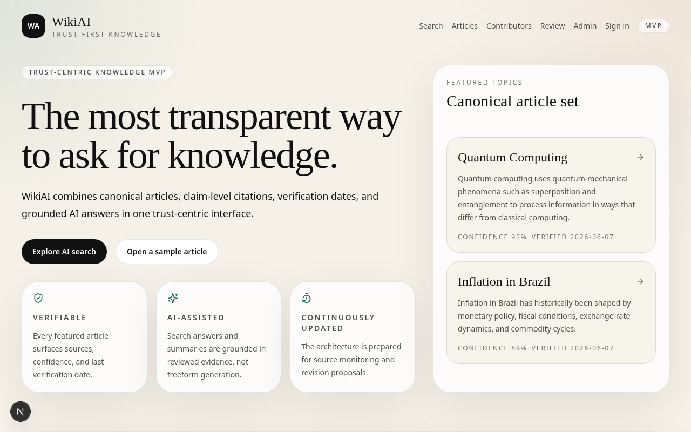

<div align="center">

# WikiAI

**The most transparent way to ask for knowledge.**

Canonical articles, claim-level citations, verification dates, and grounded AI answers in one trust-centric interface.

[](LICENSE)
[](package.json)
[](apps/api/pyproject.toml)
[](docs/reference/current-mvp.md)

</div>



WikiAI is an AI-powered encyclopedia MVP. The product is a public [epistemic database](docs/glossary.md#epistemic-database): machine-readable articles, [claims](docs/glossary.md#claim), citations, and trust metadata. The website is one view into that database.

This repository is a working MVP, not a production `v1`. Demo auth, SQLite-by-default storage, and seeded content are intentional. See [what the MVP ships](docs/reference/current-mvp.md) and the [target architecture](docs/explanation/architecture.md).

## Prerequisites

- Node.js 18.18 or newer (Next.js 15)
- Python 3.12 or newer
- [uv](https://docs.astral.sh/uv/) for API dependencies
- Docker, only if you run PostgreSQL instead of the default SQLite file

## Install and run

From the repository root, install the frontend workspace, then start the API and the web app.

```bash
npm install
```

```bash
cd apps/api
uv sync
uv run uvicorn app.main:app --reload
```

The API listens on `http://localhost:8000` and creates a local SQLite file at `apps/api/wikiai.db` on first start.

In a second terminal:

```bash
npm run dev:web
```

The frontend listens on `http://localhost:3000` and calls `http://localhost:8000` by default.

> **Note:** Postgres is optional. The default local database is SQLite. To use PostgreSQL, follow [Use PostgreSQL locally](docs/how-to/use-postgres.md).

## Verify

1. `curl -s http://localhost:8000/health` returns `{"status":"ok","environment":"development"}`.
2. Open `http://localhost:3000` and then `/articles/quantum-computing`.
3. Open the generated API docs at `http://localhost:8000/docs`.

A longer walkthrough is in [Get the MVP running](docs/tutorials/getting-started.md).

## Demo accounts

Sign-in is email-only. There is no password. Open `/signin` and continue as one of:

- `contributor@example.com`
- `reviewer@example.com`
- `admin@example.com`

These accounts are seeded demo users, not production identity. See [Sign in and use roles](docs/how-to/sign-in-and-roles.md).

## Contribute

See [CONTRIBUTING.md](CONTRIBUTING.md) for how to change code and docs together.

## Documentation

Start at [docs/README.md](docs/README.md). That index maps tutorials, how-to guides, reference, and explanation.

## License

[MIT](LICENSE)
